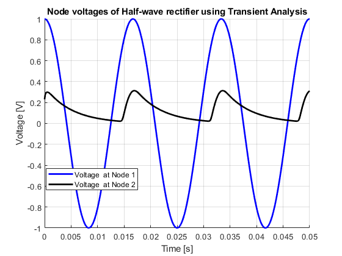
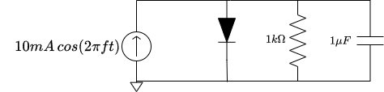
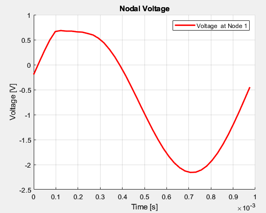

# MATLAB MNA Circuit Simulator
**ECSE 472 — Electrical Engineering | McGill University**

---

## Project Overview

This project implements a full **Modified Nodal Analysis (MNA) circuit simulator** in MATLAB, built incrementally across four deliverables. The simulator takes a SPICE-style netlist as input and performs DC, transient, and harmonic balance analyses on arbitrary circuit topologies.

The project covers the core mathematical foundations of circuit simulation — from matrix stamping and nonlinear Newton-Raphson solving, to frequency-domain Harmonic Balance analysis — mirroring the techniques used in industry-standard simulators like SPICE.

---

## Project Structure

```
mna-simulator/
├── AriZ_472_D1.m          ← Deliverable 1: MNA matrix generation
├── AriZ_472_D4.m          ← Deliverable 4: Harmonic Balance (development)
├── AriZ_472_D4_final.m    ← Deliverable 4: Harmonic Balance (final)
└── images/                ← Circuit diagrams and simulation results
```

---

## Deliverable 1 — MNA Matrix Assembly

**Objective:** Parse a SPICE-style netlist and generate the G, C, and b matrices used in MNA.

The simulator reads a netlist file, identifies circuit elements, builds a node database, and stamps each element into the appropriate matrix:

- **G matrix** — conductance (resistors, voltage source KVL rows)
- **C matrix** — dynamic elements (capacitors)
- **b vector** — independent sources (RHS)

**Supported elements:** Resistors (R), Capacitors (C), Current Sources (I), Voltage Sources (V), Voltage-Controlled Voltage Sources (VCVS / E)

**Example netlist input:**
```
*name of circuit
Vin n1 0 DC 6
R1 n1 n2 100
R2 n2 0 50
.end
```

The program outputs the assembled G, C, b matrices and attempts a DC solve (x = G\b) when no dynamic elements are present.

---

## Deliverable 2 — Diode & Inductor Stamps + Nonlinear DC Analysis

**Objective:** Extend the simulator with diode and inductor element stamps, and implement nonlinear DC operating point analysis using Newton-Raphson iteration.

The diode is modeled using the Shockley equation:

$$i_D(v) = I_s \left( e^{v / V_t} - 1 \right)$$

with saturation current $I_s = 10^{-14}$ A and thermal voltage $V_t = 0.025$ V.

**Test netlist (diode circuit):**
```
* diode circuit
Vin n1 0 DC 1
D1 n1 n2
R n2 0 50
.op
.end
```

**Expected result:** V1 = 1 V, V2 = 0.2673 V, I_E = 0.0053 A

---

## Deliverable 3 — Transient Analysis via Backward Euler

**Objective:** Implement linear and nonlinear transient analysis using the Backward Euler method.

Backward Euler discretizes the system at each time step:

$$\left( \frac{C}{h} + G \right) x_{n+1} = \frac{C}{h} x_n + b$$

For nonlinear circuits (e.g. with diodes), Newton-Raphson is applied at each time step to solve the resulting nonlinear system.

**Test circuit — Half-Wave Rectifier:**

```
* a half-wave rectifier circuit
Vin n1 0 COS 1 60
D1 n1 n2
R1 n2 0 50
C1 n2 0 100e-6
.tran 0.05s 0.1ms
.end
```

The simulation runs for 0.05s with a time step of 0.1ms. Results show the rectified output at node n2 compared to the input at n1.



---

## Deliverable 4 — Harmonic Balance Analysis

**Objective:** Implement Harmonic Balance (HB) analysis to find the steady-state periodic solution of a nonlinear circuit in the frequency domain.

**Circuit:**



A 10 mA cosine current source at f = 1 kHz drives a parallel R-C-Diode circuit to ground. The goal is to find the steady-state periodic node voltage v(t).

**Method:**

The node voltage is expanded as a truncated Fourier series with H harmonics:

$$v(t) = a_0 + \sum_{k=1}^{H} \left[ a_k \cos(k\omega t) + b_k \sin(k\omega t) \right]$$

The unknown coefficient vector $\bar{X} = [a_0, a_1, b_1, \ldots, a_H, b_H]^T$ is solved by forming the Harmonic Balance system:

$$(\bar{G} + \bar{C})\bar{X} + \bar{F}(\bar{X}) = \bar{B}$$

where $\bar{F}(\bar{X})$ represents the harmonic coefficients of the nonlinear diode current, computed via the **Gamma matrix** (collocation):

$$\bar{F} = \Gamma^{-1} f(\Gamma \bar{X})$$

The Jacobian for Newton-Raphson is:

$$J = \bar{G} + \bar{C} + \Gamma^{-1} \cdot \text{diag}\left(\frac{df}{dv}\right) \cdot \Gamma$$

**Parameters:**

| Parameter | Value |
|-----------|-------|
| Frequency | 1 kHz |
| Current amplitude | 10 mA |
| Resistance | 1 kΩ |
| Capacitance | 1 μF |
| Diode $I_s$ | $10^{-14}$ A |
| Diode $V_t$ | 0.025 V |
| Harmonics H | 17 |

Newton-Raphson converges to the steady-state solution, and the reconstructed v(t) is plotted over one period.



---

## Key Concepts Demonstrated

- SPICE-style netlist parsing and tokenization
- MNA matrix stamping for R, C, L, V, I, VCVS, Diode
- Newton-Raphson for nonlinear DC and transient analysis
- Backward Euler time integration
- Harmonic Balance with Gamma collocation matrix
- Fourier series reconstruction of steady-state waveforms
